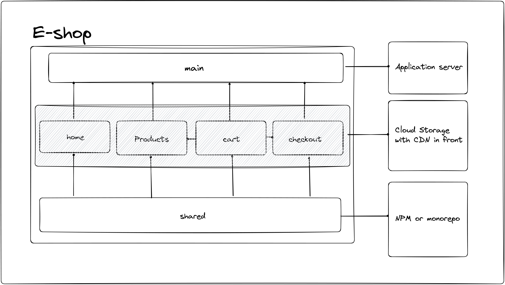

# E-shop with MF

This project is a simple e-commerce platform built using the micro frontend architecture with Webpack Module Federation. The goal of this project is to demonstrate how to build an application using multiple micro frontends. Includes state management, TypeScript, and more.

## Application Overview

The project consists of five different applications, each serving a unique purpose.

It consumes the `https://fakestoreapi.com/` API to get the products.

The applications are as follows:

- **Main**: This is the application shell that connects all the other apps together. Built with Next.js, runs by default at `http://localhost:3000`
- **Products**: This application is responsible for displaying the list of products available for sale on the platform and the product details page with ability to add the product to the cart. Built with Next.js, runs by default at `http://localhost:3001`
- **Cart**: This application is responsible for managing the items in the user's shopping cart. Built with Next.js, runs by default at `http://localhost:3002`
- **Checkout**: This application is responsible for handling the checkout process. Built with Next.js, runs by default at `http://localhost:3003`
- **Home**: This is the application responsible for displaying the home page of the e-commerce platform. Built with Vue.js, runs by default at `http://localhost:3004`
- Shared: This is the package where all shared code lives.

The micro frontend architecture used in this project allows for the seamless integration of each application into the platform. With Webpack Module Federation, each application can be developed and deployed independently, making the development process more efficient.

## Getting Started

The project uses lerna to manage dependencies and running the applications.

To get started with the project, follow these steps:

1. Clone the repository to your local machine.
2. Install the necessary dependencies using the `npm install` command.
3. Start the applications using the `npm run dev` command.
4. Explore the application at `http://localhost:3000`
5. To build the files for production, run `npm run build`

## Deployment

Here is how the application could be deployed to production if it was production ready:

- Main: Run the application server that serves the application (Own hosting, Vercel, Netlify, etc.)
- Micro frontends: Build the artifacts and deploy them to a cloud storage (S3, Google Cloud Storage, etc.) and put them in front of a CDN. When the main application needs a specific micro frontend, it would make a request and fetch it at runtime.
- Shared: This is treated as library and could be integrated by deploying to NPM or consumed via the monorepo setup.

## Contributing

If you would like to contribute to the project, please follow these steps:

1. Fork the repository.
2. Make your changes to the code.
3. Submit a pull request.
